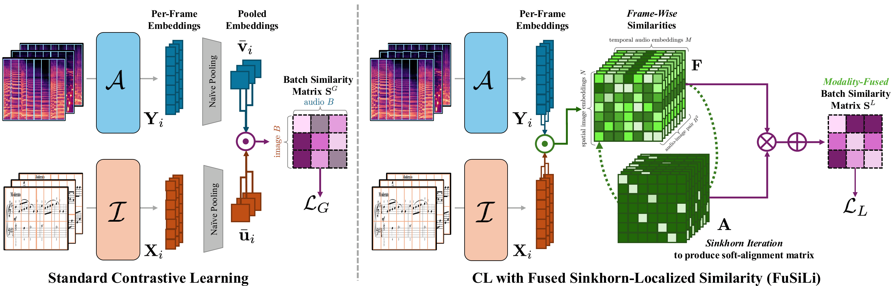

# FuSiLi: Fused Sinkhorn-Localized Similarity

**Official implementation of ["Local Multimodal Music Alignment from Global Supervision"](https://arxiv.org/abs/2607.10023) (accepted to ISMIR 2026).**

<p align="center">
  
</p>

## Overview

FuSiLi (**Fu**sed **Si**nkhorn-**Li**calized Similarity) is a contrastive learning objective for multimodal music representation learning. Instead of computing similarity only between globally pooled embeddings, FuSiLi performs alignment directly between **local image patches** and **audio frame representations**, allowing models to learn fine-grained cross-modal correspondences using only globally paired training data.

The method is designed for settings where dense supervision between modalities (e.g., frame-to-note or frame-to-pixel annotations) is unavailable, but paired examples such as score images and audio performances are readily accessible.

## Abstract

Understanding music requires learning localized relationships across modalities—for example, mapping moments in a performance to locations in a sheet music image. However, obtaining supervision for these local correspondences is expensive, and most existing approaches rely only on global supervision from paired examples.

FuSiLi introduces a Sinkhorn-based localized similarity function for multimodal contrastive learning that operates directly on local image patch and audio frame representations. By softly aligning local features before global pooling, the resulting representations capture both local correspondence structure and global semantic information. The method can be used to fine-tune pretrained vision and audio encoders while requiring only globally paired image-audio examples.

## Method

Traditional contrastive learning compares **globally pooled embeddings**, discarding the spatial and temporal structure of each modality before similarity is computed.

FuSiLi instead follows a **fuse-then-pool** strategy:

1. Extract local image patch embeddings and audio frame embeddings.
2. Compute a dense patch-frame similarity matrix.
3. Apply Sinkhorn iterations to obtain soft one-to-one correspondences.
4. Compute a localized contrastive objective from the aligned local representations.
5. Optimize a hybrid objective combining the localized FuSiLi objective with the standard global contrastive objective computed from pooled embeddings.

This enables the learned representations to preserve localized cross-modal structure while maintaining strong global retrieval performance.

## Repository Structure

```text
code/
├── dataset.py           # Dataset loading
├── model.py             # FuSiLi model and similarity computation
├── finetune_ddp.py      # Distributed training
├── hyperparams.py       # Configuration
└── utils.py             # Utility functions

docs/
├── assets/              # Figures and demo media
├── index.html           # Project page
└── style.css
```

## Getting Started

Clone the repository:

```bash
git clone https://github.com/irmakbky/fusili.git
cd fusili
```

Train the model:

```bash
torchrun --nproc_per_node=<NUM_GPUS> code/finetune_ddp.py
```

Training hyperparameters can be configured in `code/hyperparams.py`.

## Implementation Notes

FuSiLi requires access to both global embeddings and local representations (e.g., image patches and audio frames) from the underlying encoders. In the current implementation, local features are obtained by extending the encoder interfaces with a `full_rep` option (e.g., in `encode_image(..., full_rep=True)` and `get_audio_embedding_from_data(..., full_rep=True)`). Since this functionality is encoder-specific, users should implement their own local feature extraction pipeline for their chosen image and audio encoders.

## Project Page

The project webpage contains qualitative alignment visualizations and additional details:

https://irmakbky.github.io/fusili/

## Citation

If you use FuSiLi in your research, please cite:

```bibtex
@misc{bukey2026localmultimodalmusicalignment,
      title={Local Multimodal Music Alignment from Global Supervision}, 
      author={Irmak Bukey and Zachary Novack and Jongmin Jung and Dasaem Jeong and Chris Donahue},
      year={2026},
      eprint={2607.10023},
      archivePrefix={arXiv},
      primaryClass={cs.SD},
      url={https://arxiv.org/abs/2607.10023}, 
}
